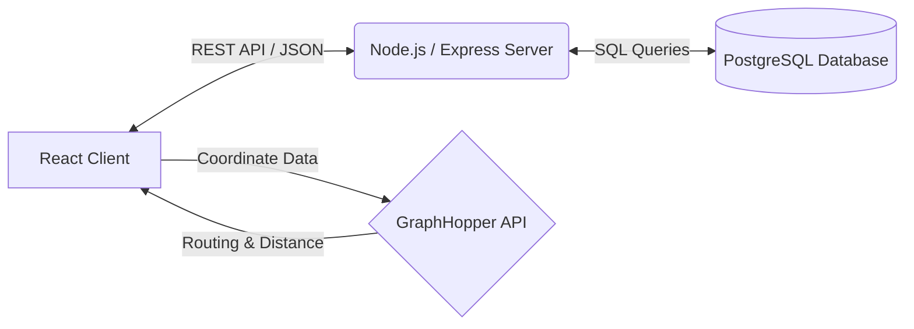

[comment]: # "This is the standard layout for the project, but you can clean this and use your own template, and add more information required for your own project"

<!-- Once you fill the index.json file inside /docs/data, please make sure the syntax is correct. (You can use this tool to identify syntax errors)

Please include the "correct" email address of your supervisors. (You can find them from https://people.ce.pdn.ac.lk/ )

Please include an appropriate cover page image ( cover_page.jpg ) and a thumbnail image ( thumbnail.jpg ) in the same folder as the index.json (i.e., /docs/data ). The cover page image must be cropped to 940×352 and the thumbnail image must be cropped to 640×360 . Use https://croppola.com/ for cropping and https://squoosh.app/ to reduce the file size.

If your followed all the given instructions correctly, your repository will be automatically added to the department's project web site (Update daily)

A HTML template integrated with the given GitHub repository templates, based on github.com/cepdnaclk/eYY-project-theme . If you like to remove this default theme and make your own web page, you can remove the file, docs/_config.yml and create the site using HTML. -->

# Smart Tourism Management System

---

## Team
-  E/23/161, Kanchana K.L.A.Y.R., [email](mailto:e23161@eng.pdn.ac.lk)
-  E/23/187, Kumarasinghe K.M.D.S., [email](mailto:e23187@eng.pdn.ac.lk)
-  E/23/202, Liyanagama K.L.D.H., [email](mailto:e23202@eng.pdn.ac.lk)
-  E/23/300, Ranathunga S.M.R.S., [email](mailto:e23300@eng.pdn.ac.lk)

<!-- Image (photo/drawing of the final hardware) should be here -->

<!-- This is a sample image, to show how to add images to your page. To learn more options, please refer [this](https://projects.ce.pdn.ac.lk/docs/faq/how-to-add-an-image/) -->

<!--  -->

#### Table of Contents
1. [Introduction](#introduction)
2. [Solution Architecture](#solution-architecture )
3. [Software Designs](#software-designs)
4. [Testing](#testing)
5. [Conclusion](#conclusion)
6. [Links](#links)

# Smart Tourism Platform

## Introduction

### The Problem
The modern travel industry often suffers from a fragmented planning experience. Tourists struggle to connect reliable geographic routing with trusted local expertise. Planning an itinerary, finding a verified travel guide who covers those specific locations, and negotiating fair prices usually requires juggling multiple disconnected platforms, emails, and messaging apps.

### The Solution
The Smart Tourism SaaS Platform provides a centralized, intelligent ecosystem that bridges the gap between tourists and travel professionals. By integrating dynamic map-based itinerary planning with a real-time engagement portal, the platform allows tourists to plot their journeys and instantly match with specialized local guides. 

### Impact
*   **Empowered Tourists:** Simplifies travel logistics through automated route calculation (distance, time, cost) and secure, transparent price negotiations.
*   **Economic Growth for Guides:** Provides a digital storefront for local guides to build a portfolio, receive direct requests, and manage client engagements professionally.
*   **Trust and Transparency:** Fosters a reliable tourism environment through role-based authentication and structured quoting systems.

---

## Solution Architecture

The platform operates on a robust, decoupled Client-Server architecture utilizing a modern stack designed for high performance and scalability.

*   **Frontend (Presentation Layer):** Built with React.js, featuring a responsive, glassmorphic UI. Uses Context API for state management and React-Leaflet for interactive map rendering.
*   **Backend (Business Logic Layer):** A Node.js and Express server handling routing, validation, and authentication. Implements secure JWT-based authorization.
*   **Database (Data Layer):** A relational PostgreSQL database ensuring strict data integrity, utilizing complex joins for engagement tracking and schema constraints for user roles.
*   **External Integrations:** Leverages the GraphHopper Routing API to process geographical coordinates and return accurate driving distances, durations, and cost estimates.

---

## Software Designs

### 1. Database Schema Design
The database is normalized to eliminate redundancy and enforce data integrity across user types and application features.

| Entity | Primary Responsibility | Key Relationships |
| :--- | :--- | :--- |
| `users` | Core authentication & role management (Tourist/Guide) | Parent to Profiles, Bookings, Itineraries |
| `itineraries` | Stores user-created trips and date ranges | Belongs to `users` |
| `itinerary_items` | Junction table for ordered geographical locations | Links `itineraries` to `places` |
| `bookings` | Tracks engagement requests and price quotes | Links `itineraries`, `tourists`, and `guides` |
| `booking_messages`| Real-time negotiation logs | Belongs to `bookings` |

### 2. API & Endpoint Design
The backend exposes a RESTful API structured around resource-based routing. All protected routes require a valid JWT Bearer token.
*   **Authentication Flow:** `/api/auth/register`, `/api/auth/login`
*   **Engagement Queue:** `/api/bookings/:id/quote` (PUT), `/api/bookings/:id/messages` (GET/POST)
*   **Data Aggregation:** `/api/places`, `/api/guides/suggest`

### 3. User Interface (UI) Design
*   **Visual Aesthetics:** Utilizes a modern "glassmorphism" design system with deep contrast, vibrant gradients, and smooth micro-animations.
*   **High-Density Layouts:** The engagement portal uses collapsible accordion architectures to present dense booking data cleanly.
*   **Responsive Behavior:** The CSS Grid and Flexbox layouts ensure 100% usability across desktop, tablet, and mobile breakpoints.

---

## Testing

Comprehensive testing was conducted across multiple environments to ensure platform stability, data security, and UI responsiveness.

### Testing Summary

| Test Category | Methodology | Scope & Focus | Status |
| :--- | :--- | :--- | :--- |
| **Unit Testing** | Manual / Scripted | Validating utility functions, regex patterns (e.g., 10-digit phone number enforcement starting with '0'). | Passed |
| **API / Endpoint Testing** | Postman | Ensuring HTTP status codes (200, 201, 400, 403, 404), JWT token validation, and correct JSON payload structures. | Passed |
| **Integration Testing** | End-to-End | Testing the full cycle: Tourist creates itinerary → System matches Guide → Tourist requests Guide → Guide sends Quote. | Passed |
| **UI/UX Testing** | Browser DevTools | Verifying layout integrity on different screen sizes and ensuring dark/light theme persistence. | Passed |

### Key Findings
*   **Routing API Resilience:** GraphHopper requests successfully handle off-road coordinates by filtering unreachable data points, ensuring the UI does not crash.
*   **Security:** Unauthorized access attempts to specific engagement queues are correctly rejected by the backend middleware with `403 Forbidden` responses.

---

## Conclusion

### What Was Achieved
The Smart Tourism platform successfully delivered a minimum viable product (MVP) that seamlessly merges interactive geographical planning with professional service procurement. We established a secure PostgreSQL architecture, an intuitive React interface, and a functioning marketplace for travel coordination.

### Future Developments
1.  **Mobile Application:** Developing a React Native counterpart for guides to receive push notifications and respond to quotes on the go.
2.  **AI-Powered Recommendations:** Implementing machine learning algorithms to suggest custom itineraries based on a tourist's previous ratings and search history.
3.  **Integrated Payment Gateway:** Transitioning from "Price Negotiation" to actual secure, in-app monetary transactions (e.g., Stripe integration).

### Commercialization Plans
*   **Freemium Model for Tourists:** The itinerary planner and map integrations will remain free to drive user acquisition.
*   **Subscription Tier for Guides:** Professional guides will pay a monthly nominal fee for premium portfolio placement and advanced analytics.
*   **Commission Structure:** A small percentage fee taken from successfully completed and paid bookings processed through the platform.

## Links

- [Project Repository](https://github.com/cepdnaclk/e23-co2060-Smart-Tourism){:target="_blank"}
- [Project Page](https://cepdnaclk.github.io/e23-co2060-Smart-Tourism){:target="_blank"}
- [Department of Computer Engineering](http://www.ce.pdn.ac.lk/)
- [University of Peradeniya](https://eng.pdn.ac.lk/)

[//]: # (Please refer this to learn more about Markdown syntax)
[//]: # (https://github.com/adam-p/markdown-here/wiki/Markdown-Cheatsheet)
